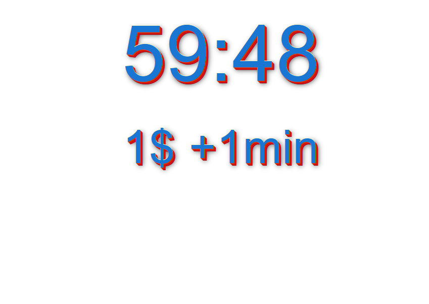
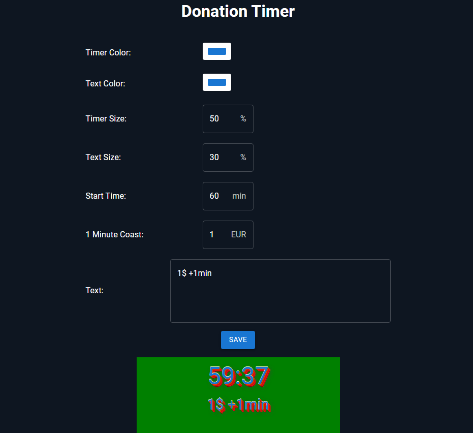

# Donation Timer

A donation timer widget for your stream. Display a dynamic countdown timer that shows donation progress in real-time.

## Features

- **Real-time Countdown**: Display a customizable countdown timer
- **Customizable Appearance**: 
  - Adjustable timer and text colors
  - Configurable font sizes
  - Flexible layout options
- **Multilingual Support**: Available in multiple languages (English, German, Spanish, French, Portuguese, Russian, Ukrainian, Arabic, Hindi, Chinese)
- **Easy Configuration**: Simple control panel to manage timer settings

## Screenshots

### Timer Display


### Control Panel


## Getting Started

### Installation

```bash
npm install
```

### Building

Build both control panel and view:
```bash
npm run build
```

Build individual components:
```bash
npm run build:control    # Build control panel
npm run build:view       # Build timer view
```

### Development

Watch mode for automatic rebuilds:
```bash
npm run build:control:watch   # Watch control panel
npm run build:view:watch      # Watch timer view
```

### Preview

Preview the built application:
```bash
npm run preview
```

## Configuration

The timer can be configured through the control panel with the following options:

- **Timer Color**: Customize the color of the countdown display
- **Text Color**: Set the text color for labels and additional information
- **Timer Size**: Adjust the size of the timer display (as percentage)
- **Text Size**: Configure the size of supporting text (as percentage)
- **Start Time**: Set the initial duration in minutes
- **1 Minute Coast**: Define the donation amount for each minute of time
- **Text**: Custom text to display with the timer


## License

This project is licensed under the AGPL License - see the [LICENSE-AGPL](./LICENSE-AGPL) file for details.

## Author

ik1s3v
